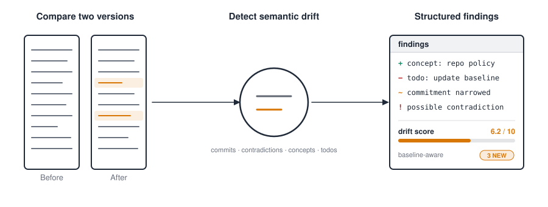
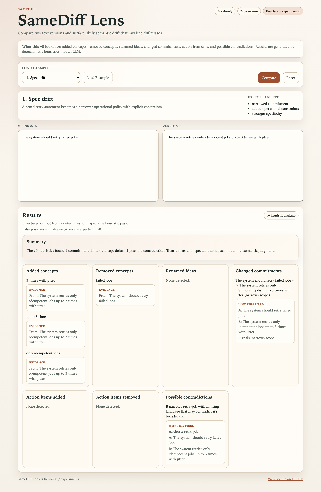
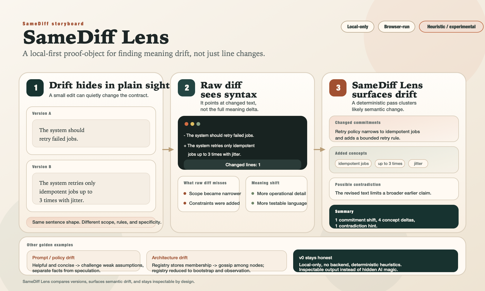

<p align="center">
  <picture>
    <source media="(prefers-color-scheme: dark)" srcset="docs/logo-dark.svg">
    
  </picture>
</p>

# SameDiff Lens

SameDiff Lens surfaces the kinds of semantic changes that raw line diff misses: commitment shifts, task drift, concept renames, and possible contradictions. No LLM, no cloud, no embeddings — just deterministic heuristics you can inspect.

A repo can declare a **semantic-drift policy** in `.samediff.json` and enforce it consistently in CI and local workflows.

Feedback on false positives, false negatives, and confusing outputs is welcome via GitHub issues.

<p align="center">
  <picture>
    <source media="(prefers-color-scheme: dark)" srcset="docs/infographic-overview-dark.svg">
    
  </picture>
</p>

## Three workflows

SameDiff is designed around three shapes of work. Each has a named path.

### 1. Local exploratory diff

Scratch-pad mode. What actually changed between two versions of a doc?

```bash
npm install && npm run build:cli
samediff before.md after.md
```

Quick variants:

```bash
samediff before.md after.md --only contradictions   # focus
samediff before.md after.md --compact               # grep-friendly lines
samediff before.md after.md --md -o review.md       # shareable report
cat draft.md | samediff - reference.md              # stdin piping
samediff --git HEAD~1 -- spec.md                    # diff against git
```

There are five example pairs in `examples/`, from simple to advanced — see [examples/README.md](examples/README.md).

### 2. CI with baseline-aware gating

You want CI to enforce a drift contract: commitment shifts and contradictions must be flagged, concept churn can pass. You declare the contract once and check it in.

```bash
# One-time setup in your repo
samediff init                              # writes .samediff.json
samediff baseline docs/spec.md docs/spec.md   # writes .samediff-baseline.json
                                             # (use any two references you trust)
git add .samediff.json .samediff-baseline.json
```

In CI:

```bash
samediff --git origin/main -- docs/spec.md
# the config's default_policy kicks in automatically
# non-zero exit => CI fails on the defined contract
```

No flags — policy comes from the checked-in config. Local developers see the same behavior because the config is in-tree.

### 3. Gradual adoption (only new drift fails)

For repos with existing drift you don't want to fix right now. "Don't yell at me about yesterday's drift. Tell me what I'm adding today."

```bash
samediff init                                 # default_policy = adoption
samediff baseline docs/spec.md docs/spec.md   # snapshot current state
```

Now every run uses the `adoption` built-in policy, which:

- subtracts the baseline from both findings and drift score
- fails only on **new** drift ≥ moderate severity (`score:4`)
- focuses on the dangerous categories (commitment shifts, contradictions)

In CI:

```bash
samediff --git origin/main -- docs/spec.md
# passes if your change didn't make drift worse than the baseline
```

As drift gets cleaned up, update the baseline (`samediff baseline …`) and the ratchet tightens.

---

## Config file (`.samediff.json`)

`samediff init` writes a starter that looks like this:

```json
{
  "default_policy": "adoption",
  "policies": {
    "adoption": {
      "baseline": ".samediff-baseline.json",
      "include": ["commitment-shifts", "contradictions"],
      "fail_on": "score:4"
    },
    "strict": { "fail_on": "commitment-shifts,contradictions" },
    "advisory": { "fail_on": null }
  }
}
```

SameDiff walks up from the current directory to find `.samediff.json` (stopping at `$HOME` or the filesystem root). Use `--config <path>` to override, or `--no-config` to disable.

### Built-in policies

Always available, even without a config file:

| Policy | Use when | Behavior |
| ------ | -------- | -------- |
| `adoption` | Messy or newly onboarded repo | Uses `.samediff-baseline.json`; fails only on NEW drift (score ≥ 4) in commits / contradictions |
| `strict` | Mature repo that's paid down drift debt | Fails on any commitment shift or contradiction. No baseline. |
| `docs-only` | Design docs / essays / prose repos | Focuses on commits, contradictions, concepts, todos; fails at score ≥ 5 |
| `advisory` | PR comment / annotation bot | Reports only; never fails the build |

List them anywhere: `samediff policies`.

### Precedence

Effective options are merged from four layers, highest wins:

1. Explicit CLI flags (`--fail-on`, `--only`, `--baseline`, …)
2. Selected policy (via `--policy <name>` or `default_policy` in config)
3. Top-level config block (`baseline`, `include`, `exclude`, `fail_on`, …)
4. Built-in defaults

Array fields (`include`, `exclude`) **replace** across layers — they do not union. If a policy sets `include: ["commits"]` and you pass `--only concepts`, the effective include is `["concepts"]` alone.

`fail_on: null` (or `"none"` / `"never"`) means "never fail the build" — that's how `advisory` works, and it's what `--fail-on none` does from the CLI.

### Named policies in the config

You can add or override any policy in the config:

```json
{
  "default_policy": "my-repo-policy",
  "policies": {
    "my-repo-policy": {
      "baseline": ".samediff-baseline.json",
      "include": ["commitment-shifts", "contradictions", "action-items-added"],
      "exclude": ["concept-renames"],
      "fail_on": "score:5"
    }
  }
}
```

Built-in names (`adoption`, `strict`, `docs-only`, `advisory`) can be redefined in your config — your version wins. `samediff policies` shows `(override)` next to those.

---

## All the flags

Use `samediff --help` for the full list. Grouped here for reference:

**Output formats:** `--md`, `--html`, `--json`, `--compact`, `--github`, `--stats`, `--score`, `-o <file>`

**Focus / noise:** `--only`, `--exclude`, `--baseline`, `--no-baseline`

**CI gating:** `--fail-on any|score:N|<cats>|none`, `--exit-code` (legacy)

**Config / policy:** `--config <path>`, `--no-config`, `--policy <name>`, `--no-policy`

**Subcommands:** `samediff init`, `samediff policies`, `samediff baseline <left> <right>`, `samediff check <left> <right>`

**Inputs:** `<left> <right>`, `- <right>` or `<left> -` (stdin), `--git <ref> -- <file>`

### Pipe-friendly outputs

```bash
samediff a.md b.md --compact          # one finding per line (CATEGORY\tdetail)
samediff a.md b.md --stats            # one-line key=value counts
samediff a.md b.md --github           # GitHub Actions annotations
samediff a.md b.md --json             # canonical structured result
```

The `--json` output includes an additive `policy` block when a config/policy shaped the run, plus a `filters` block with baseline provenance. Schema version is stable at `"1"`.

---

## Source anchoring

SameDiff Lens points findings back to where they came from. Every finding carries structured **provenance**: which side of the comparison it came from, which line range, and — when available — the matching snippet.

Terminal output shows a concise anchor suffix on each finding:

```
COMMITMENT SHIFTS
  - Clients should validate tokens before each request
  + Clients must validate tokens before each request
    strengthens the commitment  @ before:2 after:2

ADDED CONCEPTS
  + required for all production
    @ after:3
```

`--compact` appends an anchor tab field:

```
COMMITMENT	Clients should validate tokens… → Clients must validate tokens…	@ before:2 after:2
ADDED	required for all production	@ after:3
```

`--json` finds carry a full `provenance` object:

```jsonc
{
  "type": "commitment-shift",
  "summary": "...",
  "evidence": { "before": "...", "after": "...", "triggers": ["..."] },
  "provenance": {
    "anchors": [
      { "side": "before", "startLine": 2, "endLine": 2,
        "startColumn": 1, "endColumn": 51,
        "snippet": "Clients should validate tokens before each request",
        "quality": "exact" },
      { "side": "after", "startLine": 2, "endLine": 2,
        "startColumn": 1, "endColumn": 49,
        "snippet": "Clients must validate tokens before each request",
        "quality": "exact" }
    ],
    "quality": "exact"
  }
}
```

`--github` uses after-side anchors to pin annotations to the exact line in the right-hand file, so findings show up inline in PR checks next to the affected text — not at the top of the file.

Quality labels are honest: `"exact"` when the evidence was found verbatim, `"approximate"` when located only after whitespace/case normalization, `"derived"` when the anchor was inferred from higher-level matching. Findings that can't be located carry `provenance: null` rather than inventing a line number.

### PR semantic reviewer (GitHub Actions)

This repo ships a `pull_request` workflow at [`.github/workflows/pr-semantic-review.yml`](.github/workflows/pr-semantic-review.yml) that dogfoods SameDiff Lens on its own PRs. It runs without any external service — GitHub Actions, `GITHUB_TOKEN`, and the built-in CLI are the only moving parts.

What it does on every PR:

1. Identifies changed files via `git diff --name-only BASE...HEAD`.
2. Narrows that list to a small allowlist of high-signal markdown artifacts (see below).
3. For each analyzable file, runs `samediff --git <base> -- <path>` and captures both `--json` and `--sarif` output.
4. Merges the per-file SARIF into one log and uploads it to GitHub Code Scanning (`category: samediff-lens`).
5. Renders a single Markdown summary and upserts it as a sticky PR comment (identified by the marker `<!-- samediff-lens:pr-review -->`, so reruns update in place instead of spamming).
6. Fails the workflow — and therefore any required check wired to it — when contradictions are present. All other findings inform but do not block.

**What is analyzed (initial allowlist):**

- `README.md`
- `DIRECTORS_NOTES.md`
- `LAUNCH_NOTES.md`
- `docs/**/*.md` (and `*.markdown`)

Source code, example fixtures, config, and binary artifacts are intentionally excluded. Expand the allowlist in [`tools/pr-review/paths.mjs`](tools/pr-review/paths.mjs) when a new path type has a clear, tested semantic value — not speculatively.

**What blocks merges:**

- A contradiction finding on any analyzed file. One contradiction is enough to fail the gate.
- Commitment shifts, concept renames, added/removed concepts, and action-item drift are reported but do not block. That is the cleanest first-pass gating policy; stricter repos can override it by pointing their required-check at a stricter `samediff ... --fail-on` command.

**Where the signal lands:**

| Surface | Purpose |
| --- | --- |
| SARIF upload (Code Scanning) | Per-finding, region-anchored entries in the GitHub Security tab and the PR files view |
| Sticky PR comment | Compact human summary, grouped by category, with per-file anchors and overflow links |
| Required-check gate | Block/allow merge on contradictions only |
| `$GITHUB_STEP_SUMMARY` | Mirror of the sticky comment, visible even on forked PRs where the comment can't be upserted |

**Fork safety:** the workflow uses `pull_request` (not `pull_request_target`). On fork PRs, `GITHUB_TOKEN` is read-only, so the sticky-comment step is skipped with a notice — reviewers still see the step summary and any SARIF that the platform allows. We deliberately avoid `pull_request_target` because its implicit write-token on untrusted code is a large blast radius for an advisory tool.

**Helper scripts (all testable, all inspectable):**

- `tools/pr-review/paths.mjs` — allowlist predicate + `selectChangedFiles()`
- `tools/pr-review/select-files.mjs` — stdin → stdout CLI wrapper around the predicate
- `tools/pr-review/analyze.mjs` — per-file orchestrator; emits `.pr-review-out/index.json` and a merged SARIF
- `tools/pr-review/sarif-merge.mjs` — deterministic SARIF combiner
- `tools/pr-review/comment.mjs` — sticky-comment Markdown renderer (pure function)
- `tools/pr-review/render-comment.mjs` — CLI wrapper around the renderer
- `tools/pr-review/gate.mjs` — contradiction gate; reads structured `index.json`, not the rendered comment

Covered by 19 tests in [`tools/pr-review.test.mjs`](tools/pr-review.test.mjs) (allowlist behavior, CLI smoke, comment determinism, SARIF merge, gate exit codes).

### SARIF 2.1.0 export

For code scanning tools and static-analysis pipelines:

```bash
samediff --git origin/main -- docs/spec.md --sarif -o samediff.sarif
```

The SARIF output is a mechanical renderer on top of the same DiffResult that `--json` emits. Provenance drives `physicalLocation.region`; the tool never invents a region it doesn't have.

Mapping at a glance:

| Finding | SARIF `ruleId` | Level | Primary location | Related location |
| --- | --- | --- | --- | --- |
| commitment shift | `commitment-shift` | warning | after | before |
| contradiction | `contradiction` | error | after | before |
| concept rename | `concept-renamed` | note | after | before |
| concept added | `concept-added` | note | after | — |
| concept removed | `concept-removed` | note | **before** | — |
| action item added | `action-item-added` | note | after | — |
| action item removed | `action-item-removed` | note | **before** | — |

Removed-on-before findings (removed concepts, removed action items) use the before file as their primary `artifactLocation` rather than pretending to exist on the after side. Unanchored findings still appear as SARIF results but omit physical locations — the shape is "useful message with no region" instead of "fake region."

Useful properties:
- `runs[0].properties.driftScore` / `driftLabel` / `counts` — same score/counts as `--json`
- `result.properties.anchorQuality` — `"exact"` / `"approximate"` / `"derived"` when provenance exists
- `result.properties.confidence` — on concept-rename results only

Artifact URIs are relative to the current working directory when paths fall under it (good for GitHub code scanning upload), or basename otherwise. `--sarif` composes with `-o`, `--policy`, `--baseline`, `--only/--exclude`, and `--fail-on` like any other format.

## Browser UI

- [Live demo](https://henry-filgueiras.github.io/samediff-lens/)
- Local run: `npm install && npm run dev`

### Try the browser UI in 20 seconds

1. Load one of the built-in examples.
2. Click `Compare`.
3. Inspect the category cards and the compact evidence blocks.
4. Or open two local `.txt` / `.md` files and export a report.

## What this is / what this is not

This is:

- a browser-only proof-object for semantic drift
- a deterministic heuristic analyzer you can inspect
- a faster way to spot contract changes that raw diff under-explains
- a local-only tool that can open plain text or Markdown files and export a compact report
- a lightweight way to report weird results without sending your full source text by default

This is not:

- a backend service or collaboration platform
- a claim of deep semantic understanding
- an LLM wrapper or hidden AI workflow

## Why this exists

- Raw diff shows where text changed, not necessarily what changed in meaning.
- Small edits can quietly narrow commitments or move responsibilities.
- Spec, prompt, and architecture drift often matter more than line count.
- v0 aims for honest, inspectable signals over opaque sophistication.

## Concrete example

```text
Version A
The system should retry failed jobs.

Version B
The system retries only idempotent jobs up to 3 times with jitter.
```

Expected v0 output, in spirit:

- changed commitment: the retry policy got narrower
- added concepts: `idempotent jobs`, `up to 3 times`, `jitter`
- possible contradiction: the broader earlier claim is now limited

The v0 contract lives in [docs/v0-contract.md](docs/v0-contract.md).

## What v0 does

SameDiff runs as a CLI tool or in the browser, with no backend, no auth, no database, and no cloud calls. It uses simple deterministic heuristics to:

- extract likely added and removed concepts
- detect changed commitments and constraint shifts
- compare action-like bullets and TODO-style phrasing
- guess renamed ideas when surrounding context stays similar
- flag possible contradictions or responsibility moves
- load local `.txt` / `.md` files into either side of the comparison
- export the current result as a lightweight Markdown report
- summarize the overall drift in plain language

## What v0 does not do

v0 is intentionally narrow and honest. It does not:

- claim deep semantic understanding
- use embeddings, LLM calls, or hidden cloud services
- persist data between sessions
- support collaborative workflows or version history
- guarantee correct classification on arbitrary prose

## Good use cases

- comparing two versions of a design note before review
- comparing prompt revisions for policy or stance drift
- comparing spec, incident runbook, or ops checklist edits

## Run locally

Requirements:

- Node.js 20+
- npm 10+

Install:

```bash
npm install
```

Build and run the CLI:

```bash
npm run build:cli
npm run samediff -- fileA.md fileB.md
```

Start the browser UI:

```bash
npm run dev
```

Build the browser UI for production:

```bash
npm run build
```

Run the smoke tests:

```bash
npm test          # analysis engine tests
npm run test:cli  # CLI integration tests
```

## Deploy to GitHub Pages

This repo includes a GitHub Actions workflow for GitHub Pages deployment from a repository subpath.

Expected project-pages URL pattern:

```text
https://<owner>.github.io/samediff-lens/
```

Enable it:

1. Push this repo, including `.github/workflows/deploy-pages.yml`, to the default branch.
2. In GitHub, open `Settings` -> `Pages`.
3. Under `Build and deployment`, set `Source` to `GitHub Actions`.
4. Let the `Deploy GitHub Pages` workflow run on the default branch.
5. Open the deployed site at `https://<owner>.github.io/samediff-lens/`.

Notes:

- If the repository name changes, the Pages URL and Vite base path change with it.
- If you deploy from a repository named `<owner>.github.io` or use a custom domain, update the Pages base-path handling in `vite.config.ts` and the workflow env accordingly.

## Bazel entrypoints

This repo now includes lightweight Bazel wrappers around the existing local Vite workflow. They are intentionally simple: Bazel gives us stable entrypoints, while `npm install` still provisions the frontend toolchain.

One-time setup:

```bash
npm install
```

Useful targets:

```bash
bazel run //:devserver
bazel run //:build
bazel run //:test
```

You can pass extra Vite flags to the dev server:

```bash
bazel run //:devserver -- --host 0.0.0.0 --port 5173
```

## Screenshots





- App screenshot: [docs/screenshots/app-home.png](docs/screenshots/app-home.png)
- Storyboard PNG: [docs/storyboard/samediff-lens-storyboard.png](docs/storyboard/samediff-lens-storyboard.png)
- Storyboard source: [docs/storyboard/samediff-lens-storyboard.svg](docs/storyboard/samediff-lens-storyboard.svg)

Capture a fresh app screenshot locally with:

```bash
npx playwright install chromium
npm run screenshot
```

Storyboard export on macOS:

```bash
./tools/export-storyboard.sh
```

Animated GIF walkthrough: to be added.

## Repo shape

```text
bin/
  samediff.cjs          # CLI entry point wrapper
docs/
  v0-contract.md
examples/
  01-modal-shift/       # simple: may→must
  02-todo-drift/        # simple: checklist changes
  03-api-contract/      # medium: spec narrowing
  04-prompt-policy/     # medium: behavioral contract
  05-hydra-doc-drift/   # advanced: full architecture rewrite
src/
  analysis/             # heuristic detection engine (shared)
  cli/                  # CLI-specific code
  components/           # browser UI components
  examples/             # golden examples for UI + tests
  lib/                  # shared utilities (report formatter, etc.)
tools/
  analysis.test.mjs     # engine smoke tests
  cli.test.mjs          # CLI integration tests
  build-cli.sh          # CLI build script
```

## Status

This repository is a v0 proof-object: runnable, inspectable, and intentionally heuristic.
